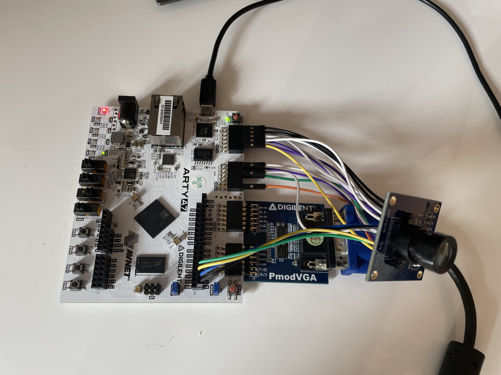

# OV7670 Camera Controller for Xilinx FPGA

This repository hosts the VHDL source code for a camera controller designed for the OV7670 camera sensor, targeting Xilinx FPGAs. The project utilizes Vivado 2020.2 for development and leverages the FPGA's BRAM for storing video frames. The controller initializes the camera through an SCCB interface and streams video output to an external monitor via a VGA interface.

## Overview

This project implements a controller on a Arty-A7 100T to interface with the OV7670 using the SCCB communication protocol, which is similar to I2C. The controller handles video signal acquisition from the camera and transmits it for display on an external VGA monitor. Frames captured from the camera are stored in the FPGA's Block RAM (BRAM), allowing for future real-time or subsequent processing.

## Features

- **Initialization of OV7670 Camera Sensor**: Configures the camera using the SCCB interface.
- **Video Frame Capture**: Reads video signals directly from the camera sensor.
- **VGA Output**: Formats and transmits video data to an external VGA monitor.
- **Frame Storage**: Utilizes the FPGA's BRAM for storing video frames.

## Prerequisites

* **Hardware**:
  - [Arty-A7 100T FPGA Board](https://digilent.com/shop/arty-a7-100t-artix-7-fpga-development-board/)
  - OV7670 Camera Sensor (No FIFO!)
  - [VGA PMOD Module](https://digilent.com/reference/pmod/pmodvga/start)
* **Software**: Vivado Design Suite 2020.2.

## Project Structure

- **constr/**: Constraint File for the Arty-A7 100T
- **ip/**: IP Files used in this project.
- **rtl/**: Contains all VHDL source files for the camera controller.
- **sim/**: Simulation Files.

## Setup and Building

To set up and build the project, follow these steps:

1. **Install Vivado 2020.2**: Make sure Vivado 2020.2 is installed and configured on your system.
2. **Clone the Repository**: Clone this repository to your local machine.
3. **Setup the Project**: Type `make project`. The Tcl Script generates the project and includes all VHDL Codefiles and IP files needed.
4. **Open the Project in Vivado**:
    - Launch Vivado.
    - On the welcome page, select "Open Project".
    - Navigate to the cloned repository directory and open the generated project file.
5. **Generate Bitstream**: Once the project is open, generate the bitstream to program your FPGA.

## Usage

1. **Connect the OV7670 camera sensor and the VGA PMOD** to the designated FPGA pins.
2. **Connect a VGA cable** between the VGA PMOD on the FPGA and an external monitor.
3. **Power on the FPGA and monitor** to start receiving video output.

   
## License

This project is released under the MIT License.
